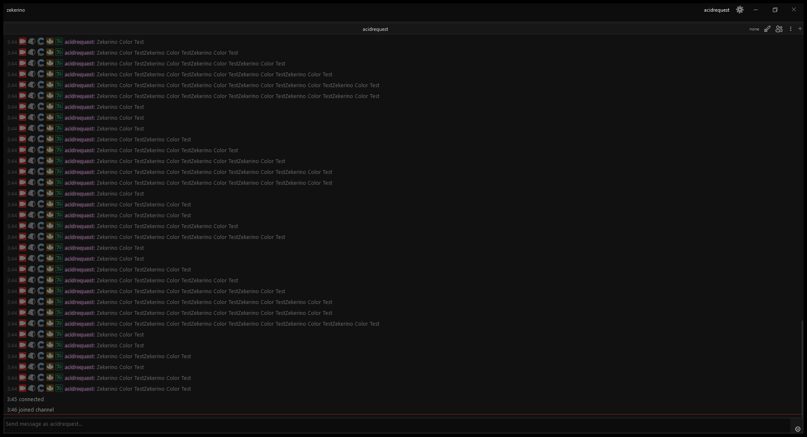
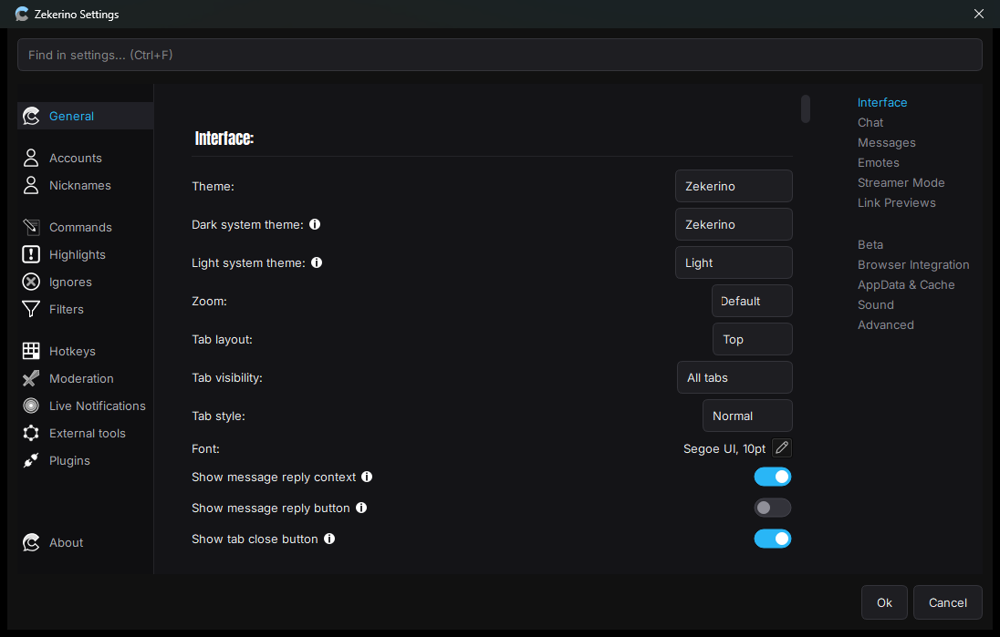

# Zekerino

My own version of Chatterino, dressed up to look like the 7TV extension. A chat app for Twitch and Kick, dark and clean.

This one is just for fun. I test a lot of stuff on it and change things all the time, so parts of it are still rough around the edges. That is kind of the point.

Under the hood it is still Chatterino, so it is the same fast, solid client you already know. I kept all of it and just changed the look and added the things I always wanted.

## What I changed

- 7TV name paints and badges show up right away, and they also load on the old messages you scroll back to, not only for people typing right now
- 7TV, BTTV and FFZ emotes show up in the text box while you type
- an emote menu when you tab complete
- a slider on each message to delete, timeout or ban in one move
- 7TV style highlights
- drag a link out as text straight into your browser
- a locked tab layout so you stop hitting the close buttons by accident
- the dark Zekerino theme by default, plus a few others to switch between
- a fresh look for the whole settings menu

## Still Chatterino

I did not take anything out. Twitch and Kick, tabs and splits, mod tools, highlights, filters, hotkeys, logging, it is all still there, because it is still Chatterino underneath. All credit to the Chatterino team, none of this happens without them.

## Build it

Same as Chatterino, with CMake and Qt 6:

- [Windows](BUILDING_ON_WINDOWS.md)
- [Windows (vcpkg)](BUILDING_ON_WINDOWS_WITH_VCPKG.md)
- [Linux](BUILDING_ON_LINUX.md)
- [macOS](BUILDING_ON_MAC.md)
- [FreeBSD](BUILDING_ON_FREEBSD.md)

## Credits

Made by zekovdev for fun, built on Chatterino which is MIT licensed. See [LICENSE](LICENSE).
